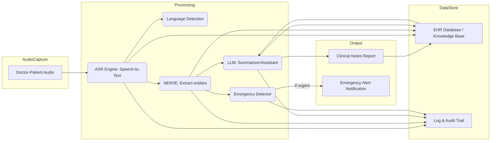

# Medical Transcription & Emergency Alert AI for Indian Healthcare

**Executive Summary:** This report outlines a comprehensive plan to build an AI-based medical transcription and emergency-detection system for India’s healthcare. The goal is to automatically convert doctor–patient audio (from clinics, wards, teleconsults, ambulances) into structured clinical notes, while flagging urgent symptoms in real time. The solution uses advanced speech-to-text (ASR) and NLP techniques, including large language models (LLMs), to extract symptoms, vitals, diagnoses, medications, and to summarize care plans. Key stakeholders include the Ministry of Health, hospitals (public/private), ambulance/EMS teams, and patients. The system covers all settings (inpatient rounds, outpatient clinics, telemedicine, ambulance calls) and assumes data (audio and text) can be collected with consent in English and major Indian languages. Success will be measured by transcription accuracy (low word-error rate), NER/IE accuracy (high precision/recall on symptoms/meds), fast response (low latency), and high emergency-detection sensitivity (to not miss critical cases). Data privacy, security, and compliance with Indian laws (DPDP Act 2023, NDHM policies) are integral. Deployment will balance on-device (edge) processing for real-time needs versus cloud for heavy LLM tasks, ensuring scalability build the minimal product that can do the task 

## Overview and Goals

- **Project Overview:** Automate clinical note-taking and triage by transcribing doctor–patient speech and detecting emergencies. Use generative AI (ASR + LLM) to produce concise medical summaries, suggest treatment plans, and immediately alert staff to red-flag symptoms (e.g. chest pain). This reduces documentation burden and speeds up emergency response. 

- **Goals:** 
  - **Accurate Transcription:** Real-time speech-to-text with medical terminology and Indian accents. 
  - **Clinical Extraction:** Identify key details (symptoms, vitals, diagnosis, medications, advice).
  - **Summarization & Advice:** Generate coherent clinical notes (SOAP format) and evidence-based treatment suggestions.
  - **Emergency Detection:** Flag life-threatening issues (e.g. “difficulty breathing”, “unconsciousness”) with very high recall.
  - **User-Friendly Reports:** Output must be clear for physicians, integrating seamlessly into existing workflows/EHRs.
  - **Compliance:** Ensure privacy/security by design (consent, data minimization, encryption).

- **Stakeholders:**  
  - **Ministry of Health & Family Welfare (MoHFW) / National Health Authority:** Sets policy, ensures national scale rollout and compliance.  
  - **Hospitals and Clinics:** Doctors, nurses, medical records staff who will use the system.  
  - **Emergency Services:** Ambulance/EMS teams benefiting from on-scene transcription and alerting.  
  - **Patients:** Indirect beneficiaries through faster, more accurate care and better medical records.  
  - **Regulators/Standard Bodies:** Bodies like NHA/NDHM requiring data standards and interoperability.  

## Scope

- **Care Settings:**  
  - *Outpatient clinics:* Doctor–patient consultations in hospitals/PHCs.  
  - *Inpatient rounds:* Ward rounds where doctors see multiple patients.  
  - *Teleconsultation:* Audio/video calls (e.g. eSanjeevani platform) with remote patients.  
  - *Ambulance/EMS:* First responders talking to victims on-site or en route.  

- **Supported Languages:** Primarily English and Hindi, plus optionally major Indian languages (e.g. Marathi, Tamil, Telugu) based on data availability. Unspecified languages can be added later via fine-tuning.  

- **Data Inputs:** Live audio (microphone/phone recordings) and pre-recorded consultations (with consent).  

- **Assumptions:**  
  - **Data Availability:** Sufficient annotated speech/text exists or can be collected (see *Datasets*).  
  - **Hardware/Connectivity:** Clinics have at least intermittent internet for cloud modules; some processing can be done on-device (edge) if needed.  
  - **Patient Consent:** Audio recording of consultations is legally obtained (informed consent).  
  - **Integration:** System can interface with existing EHR/Telehealth apps.  
  - **Multilingual Support:** Initial focus on English/Hindi transcripts, with flexibility to add more languages.  
  - **Privacy:** All processing complies with Indian data laws (see *Privacy & Compliance*).  

## Success Metrics

- **ASR Accuracy:** Target word-error rate (WER) <10% overall; even stricter on medical terms (medical-WER). For example, Whisper v3 Turbo achieves low medical-WER in noisy EMS scenarios【2†L116-L118】.  
- **Entity Extraction:** NER precision/recall >85% for critical categories (symptoms, diagnoses, vitals, drugs). 
- **Emergency Detection:** Recall (sensitivity) ideally >90% (to catch nearly all true emergencies) and precision (to limit false alarms).  
- **Latency:** End-to-end transcription-to-alert latency under 500 ms for urgent keywords; overall summary generation within a few seconds.  
- **User Satisfaction:** Positive feedback from clinicians on note quality and reduced workload (measured via pilot surveys).  
- **Compliance:** Full adherence to DPDP Act and NDHM guidelines (documented consent, audit logs, data localization).  

## System Architecture

**Figure:** High-level system flow (audio → ASR → NER/IE → LLM/Alerts → output). 

- **Audio Capture:** Microphones in clinics/ambulances or telemedicine platform capture speech.  
- **ASR Engine (Speech-to-Text):** Converts audio to raw text transcripts. It must handle multiple Indian accents and noisy backgrounds (ambulance sirens, busy wards)【2†L125-L134】【19†L22-L31】.  
- **Language Detection:** (Optional) Identifies language of transcript and routes to appropriate model.  
- **NER/IE Module:** Extracts clinical entities: symptoms (e.g. “chest pain”), vitals (e.g. “BP 140/90”), diagnoses (“pneumonia”), drugs/dosages (“500 mg paracetamol”), advice (“rest”). Uses medical NER models (e.g. Med7 or fine-tuned ClinicalBERT).  
- **Emergency Detector:** Applies rule-based and ML methods to transcripts and extracted entities. Rules: keyword spotting (“difficulty breathing”, “CPR needed”, “bleeding heavily”). ML: maybe a lightweight classifier trained on labeled urgent vs non-urgent dialogues (fine-tuned LLM or XGBoost on features). If an emergency is detected, an alert is generated.  
- **LLM Assistant:** A large language model (e.g. GPT-4o or Llama3) takes the transcript (and extracted entities) to produce: (a) a summarized clinical note (Subjective, Objective, Assessment, Plan); (b) suggested next steps or guidelines (e.g. “recommend CXR for cough”); and (c) patient instructions if needed. Prompts/templates drive its output to be concise and structured.  
- **Data Pipeline & Storage:**  
  - *Transcript Store:* Raw and processed transcripts are stored in an encrypted database (EHR DB), segmented by patient ID.  
  - *Entity Store:* Extracted fields (symptom tags, vitals) saved for analytics.  
  - *Knowledge Base:* Optionally integrate with drug/diagnosis databases for validation (e.g. Indian Pharmacopeia for drug names).  
  - *Logs & Audit:* All transcripts and outputs (including flagged emergencies) are logged for audit, compliance, and retraining.  
- **APIs & Integration:** RESTful APIs allow the ASR/NER/LLM services to be called by front-end apps. The system can push the generated notes into hospital EHR systems or state health databases (per NDHM interoperability standards).  
- **Clinician UI:** A simple interface (web or mobile) where doctors see real-time transcription, note drafts, and alerts. They can edit the draft note (ensuring accuracy) and acknowledge emergency alerts. For example, a dashboard showing current patient transcript, predicted summary, and a red flag icon if an urgent issue is detected. This UI must be intuitive and fast.  

## Components Details

- **ASR (Speech-to-Text):** Must support noisy, real-world audio and domain-specific vocab. Options:  
  - *Open-Source:* [OpenAI Whisper](https://openai.com/whisper) (multilingual, includes Hindi support), Mozilla DeepSpeech, NVIDIA Riva, Kaldi with medical lexicon. Whisper v3 variants have shown strong medical transcription in noise【2†L116-L118】【19†L22-L31】. Fine-tuning on Indian medical speech (see dataset section) improves performance.  
  - *Cloud Services:* AWS Transcribe Medical, Google Cloud Healthcare Speech-to-Text, Microsoft Azure Speech (medical). E.g. Google’s new **MedASR** (Conformer-based 105M model) was trained on 5,000h of clinical dictation and excels at medical terms【29†L113-L121】. Cloud options offer ease-of-use but require careful compliance (data residency).  
  - *Speech Enhancement:* Given ambulance noise etc., preprocessing (noise reduction) can help. Some studies found that modern ASR is fairly robust to noise, but very loud siren noise still degrades performance【2†L124-L132】. Testing in realistic conditions is essential.  

- **Clinical NER/IE:**  
  - *Entity Types:* Symptoms (fever, pain), Clinical Findings (lab results, BP, heart rate), Diagnoses (e.g. “diabetes”), Medications (drug names and doses), Procedures, Advice (e.g. “rest, hydrate”).  
  - *Approach:* Rule-based (regex) can catch numeric vitals (BP, temperature) and lists of diseases/drugs, but ML models provide flexibility. Use pretrained biomedical models: e.g. **Med7** (SpaCy) recognizes drugs and dosages【20†L1-L3】, or fine-tuned BERT models (ClinicalBERT, BioBERT) for NER. LLMs can also be prompted for structured extraction (e.g. GPT-4 with "Extract the following entities...").  
  - *Training Data:* Use datasets like the EkaCare ASR eval set, which includes transcripts labeled with medical entities【10†L218-L225】【10†L244-L248】. For example, conversation lines like “take Zincovit once a day” are labeled (Zincovit = drug)【10†L244-L248】. Additional corpora: MIMIC clinical notes (English) from PhysioNet, I2B2 challenges (de-identified discharge summaries), possibly state/national health records (de-id). Ideally augment with manually annotated Indian clinical transcripts (small-scale) to capture local disease/drug names.  

- **Emergency Detection Module:**  
  - *Rule-Based Triggers:* A curated list of critical keywords/phrases (see 【14†L71-L75】). Examples: “chest pain”, “shortness of breath”, “heavy bleeding”, “unconscious”, “overdose”, etc. These map to emergency protocols. Rules should include synonyms and contextual cues (e.g. “pain in chest” vs generic “pain”).  
  - *Voice-Tone Analysis:* (If feasible) acoustic analysis for stress/panic (heart rate in voice, pitch variability) could augment detection (as noted in voicebot research)【14†L71-L75】.  
  - *ML Classifier:* Train a lightweight model (e.g. LSTM or BERT-based) on labeled dialogues (urgent vs non-urgent) to catch subtler cases. This model inputs the transcript text (and maybe extracted entities) to predict a probability of emergency.  
  - *Fusion:* If either rule or ML flags “urgent”, system generates an alert. The alert includes urgency level and recommended action (e.g. “Call Code Blue”, “Redirect to ICU”).  
  - *Evaluation:* We will evaluate on simulated emergency transcripts (like the Swiss EMS study used 99 dialogues with noise【2†L105-L112】) to measure recall/precision.  

- **Large Language Model (LLM) Roles:**  
  - *Summarization:* Convert transcripts into structured clinical notes. For instance, after ASR, prompt an LLM: 
    > *“Summarize the following doctor-patient conversation into a medical note including chief complaint, history, vitals, and plan.”*  
    The output can follow a SOAP format.  
  - *Treatment Suggestions:* Prompt LLMs (with medical knowledge, e.g. GPT-4/GPT-4o) to suggest diagnostics or therapies, citing best practices (e.g. “For fever and cough, recommend paracetamol 500 mg TDS and a chest X-ray”).
  - *Patient Education:* Generate easy-to-understand patient instructions or discharge advice (Hindi/English).
  - *Report Generation:* Create more formal documents (e.g. discharge summary) if needed.  
  - *Interaction:* The clinician UI could allow the doctor to ask the LLM questions (e.g. “What did I say?” or “Next steps?”) after the visit.  
  - *Fine-tuning:* Domain-specific tuning (on Indian medical corpus) can improve LLM factuality. Newer open models like Llama 3 might be fine-tuned on clinical data to avoid hallucination.  
  - *Example:* Irfan et al. demonstrated using Whisper → GPT-3 for real-time Indonesian clinical notes【12†L107-L114】. Similarly, after ASR transcription we’ll feed text into an LLM to produce the standardized record.  

- **Data Pipeline:**  
  - *Ingestion:* Audio streams are sent to ASR service (edge or cloud).  
  - *Processing:* ASR outputs pass to NER and emergency modules in real time. NER tags and alerts are logged.  
  - *Database:* Use a secure database (SQL/NoSQL) to store transcripts, entities, summaries. Also integrate with EHR: e.g. save final note to patient’s record.  
  - *APIs:* Expose endpoints for each function: `/transcribe`, `/extract`, `/summarize`, `/alert`. Use microservices or serverless functions.  
  - *Batch Analytics:* Aggregate anonymized data (e.g. counts of symptoms, types of emergencies) for public health planning.  

- **Logging & Audit:**  
  - Maintain full logs of audio (or transcripts), model outputs, and clinician edits.  
  - Include user actions (who reviewed or changed notes).  
  - Audit trails meet DPDP/NDHM requirements (e.g. traceability to consent).  
  - Optionally record system performance metrics (response times, errors) for monitoring.  

- **UI/UX for Clinicians:**  
  - A simple, non-intrusive interface. For example: a tablet screen in clinic shows the live transcript (like a chat), a draft note panel, and alerts.  
  - Touch interface: Doctor taps to confirm/correct transcripts, accept or override suggestions.  
  - Visual cues for emergencies (e.g. red banner, SOS icon) and a quick button to call for help.  
  - Language switching as needed (English/Hindi).  
  - Accessibility: large fonts, clear labeling.  

## Technical Stack Options

| Component           | Open-Source Options             | Cloud Services / Proprietary              | Notes |
|---------------------|---------------------------------|-------------------------------------------|-------|
| **ASR**             | OpenAI Whisper (v3)【2†L116-L118】, NVIDIA NeMo, Kaldi (+medical lexicon) | AWS Transcribe Medical, Google MedASR【29†L113-L121】, Azure Speech, IBM Watson | Whisper is free and multilingual; MedASR is specialized for clinical speech【29†L113-L121】. Cloud ASR may be easier to deploy but requires data residency assurances. |
| **NER/IE**          | spaCy+Med7 (Med7 can extract dosage/drugs)【20†L1-L3】, SciSpacy, HuggingFace Transformers (BioClinicalBERT) | Amazon Comprehend Medical (entity extraction), Google Healthcare NLP | Open models need fine-tuning on domain data. Complying with HIPAA-like standards is easier on cloud, but we can host on-prem. |
| **LLM Summarizer**  | Llama 3, MPT, Bloom (fine-tuned) | OpenAI GPT-4/4o (API), Anthropic Claude | GPT-4/Claude likely best quality but use with caution (satellite cloud, cost). Open LLMs can run in controlled environment. |
| **Database / Storage** | PostgreSQL/MySQL (for structured data), Elasticsearch (for fast text search) | AWS RDS, GCP Cloud SQL, Azure DB | Use encrypted storage; NDHM suggests federated DBs【32†L24-L32】. |
| **Hosting / Compute** | On-premises servers (for max control), Kubernetes cluster (K3s) | AWS (Aurora, EC2, SageMaker), Google Cloud (Vertex AI, App Engine), Azure (Health Data Services) | For patient data, either in Indian cloud region or on-prem. NDHM advocates federated (state/facility) data stores【32†L24-L32】. |
| **Real-Time Messaging** | Redis, Apache Kafka | AWS Kinesis, Google Pub/Sub | For streaming audio transcripts to UI, handling alerts. |
| **Security/Compliance** | OpenSSL/TLS, Keycloak (Auth), Auditbeat (monitoring) | AWS IAM/GCP IAM, GuardDuty, Cloud Audit Logs | Must follow DPDP Act (consent, breach reporting)【16†L274-L282】【16†L289-L293】. |

### Model Training & Fine-Tuning

- **ASR Models:** Start with pre-trained ASR (e.g. Whisper, MedASR). Fine-tune on **Indian clinical data** to capture accent and vocabulary. Use the EkaCare ASR dataset (3.6K utterances in Indian English)【10†L218-L225】, and augment with synthetic data (text-to-speech of medical notes) if needed. Prompt-tuning approaches can boost performance in related languages【19†L22-L31】.  
- **NER Models:** If using BERT-based models, fine-tune on labeled clinical notes. Public corpora: i2b2 (medication extraction), n2c2 datasets, or Indian hospital data (de-identified). For Indian languages, may need annotation effort (crowdsourcing or expert labeling).  
- **LLM:** Acquire a model (e.g. GPT-4 API or open Llama 3). Tune prompts/templates; possibly fine-tune (e.g. instruction-tune Llama) on Indian medical notes. Use few-shot examples of Indian patient scenarios. Monitor for hallucination (validate suggestions against medical guidelines).  

### Datasets (training and evaluation)

- **Speech/Audio:**  
  - *EkaCare Medical ASR* (HuggingFace): 3.9K English medical dialogues with entity annotations【10†L218-L225】.  
  - *MSTC (Medical Speech Translation Corpus)*: English-Hindi patient dialogues【37†L174-L182】.  
  - *MIMIC-III Speech Extension*: ICU utterances (English, synthetic + real) for training general medical ASR【37†L133-L142】.  
  - *United-Syn-Med*: Large synthetic English medical speech (HIPAA-safe)【37†L187-L194】.  
  - *Project Vaani / Gram Vaani*: Generic Indian speech (Hindi) for background ASR adaptation (non-medical).  
- **Text/Transcripts:**  
  - *EHR Datasets:* MIMIC-IV (clinical notes), I2B2 annotated notes.  
  - *Government Reports:* Aggregated health data (Public policy, ICD codes) for schema design.  
  - *Telemedicine Logs:* If available, anonymized eSanjeevani transcripts.  
- **Evaluation Sets:** Hold out a portion of EkaCare for testing. Collect new test audio from target hospitals (volunteers). Use transcripts with induced noise (add siren sounds as in【2†L105-L112】) to test robustness.  
- **Languages:** Initially Hindi and English. We assume English and Hindi training data; other languages are optional (scope noted).  

### Evaluation Plan

- **Accuracy Metrics:** Compute WER on test set (overall and for medical words). Use medical-WER (mWER) metric focusing on symptoms/drugs【2†L116-L118】.  
- **IE Metrics:** Precision/Recall/F1 for each entity type. Use benchmark annotation (like EkaCare has ground-truth spans).  
- **Summarization Quality:** Use ROUGE/BLEU or clinician rating of summaries. Compare AI summary to human-written notes on a subset.  
- **Emergency Detection:** Measure precision and recall on a labeled test of urgent vs routine transcripts. For instance, simulate 200 transcripts with ~20% containing emergencies, see how many are flagged correctly.  
- **Latency:** Log response time of each component (ASR, NER, LLM). Ensure end-to-end meets targets.  
- **User Feedback:** Survey pilot users on note quality, time saved (qualitative metrics).  

### LLM Prompt Examples

- **Summarization Prompt:**  
  > *Input:* Transcript: “**Doctor:** Patient has fever and cough for 3 days. Temperature is 102°F, pulse 98, BP 120/80. *Patient:* I have also body aches. *Doctor:* Likely viral infection, take paracetamol 500mg TDS.”  
  > *Prompt:* “Summarize the above doctor-patient conversation into a structured clinical note (SOAP).”  
  > *Example Output:*  
  > “**S:** 45M with 3-day fever, cough, myalgia. **O:** T 102°F, P98, BP 120/80, SpO2 96%. **A:** Acute viral syndrome. **P:** Start Paracetamol 500mg t.i.d., rest, fluids; advise follow-up if no improvement. Reassurance provided.”  

- **Emergency Alert Prompt:** (for NLP model training/evaluation)  
  > “Given the transcript, does the patient have an urgent condition? If yes, output ‘EMERGENCY: [reason]’.”  
  > *Example:* Transcript: “Patient says chest is hurting badly and she’s feeling dizzy.” → “EMERGENCY: possible chest pain/dizziness.”  

- **Advice Prompt:**  
  > *Prompt:* “Based on the symptoms (fever, cough) and vital signs, what initial management steps are recommended?”  
  > *Answer:* “Administer Paracetamol 500mg TDS for fever, ensure adequate hydration, recommend chest X-ray if cough persists >5 days, advise rest.”  

## Privacy, Security & Compliance

India’s regulations demand strict data protection:  

- **Consent & Data Minimization:** Explicit informed consent is mandatory for all patient data【16†L274-L282】. Only essential data is collected (“purpose limitation”【16†L284-L288】). Patients can access, correct, or delete their data (DPDP Act)【16†L274-L282】.  
- **Data Localization & NDHM:** Health data should reside within India unless permitted. The NDHM blueprint uses a *federated architecture* – data is stored at the facility, state, and national levels as needed, minimizing transfers【32†L24-L32】. We should similarly ensure transcripts/patient records stay within approved servers (Indian cloud regions or on-prem).  
- **Security Measures:** Encryption in transit (TLS) and at rest (AES-256). Regular audits and intrusion detection. Follow NDHM “security by design” principle【32†L24-L32】.  
- **Data Protection Officer (DPO):** Appoint DPOs as per DPDP Act. Conduct Data Protection Impact Assessment (DPIA) before rollout【16†L289-L293】.  
- **Audit Logs:** Maintain logs of data access/changes (for breach reporting within 72h【16†L289-L293】). All model decisions (e.g. flagged emergencies) are logged.  
- **HIPAA-equivalent Safeguards:** Though India lacks a HIPAA law, apply similar standards (as recommended by industry sources). For example, secure storage of call recordings, user authentication, and role-based access【14†L94-L102】.  
- **Anonymization:** For any analytics or public health use, de-identify personal identifiers. Synthetic data (e.g. United-Syn-Med) can help train without real PHI【37†L187-L194】.  

## Deployment Strategy

- **Edge vs Cloud:**  
  - *On-premise/Edge:* Run ASR and emergency detector locally in hospitals for ultra-low latency and to keep PHI on-site. E.g. a small server in each hospital or ambulance unit. NVIDIA Jetson or similar can host an ASR model.  
  - *Cloud (or central servers):* Use cloud for heavy LLM tasks and data aggregation. Transcripts (text only) can be sent securely to cloud LLM for summarization. This hybrid model balances speed and compute.  
  - *Telemedicine:* Likely use a cloud setup as connectivity exists; keep transcripts in secure cloud with Indian region.  
  - *Scalability:* Containerize services (Docker/Kubernetes) for scaling to many hospitals. Use auto-scaling in cloud (AWS/GCP) for spikes (e.g. epidemics).  
- **Latency Considerations:** Prioritize low-latency for ASR→alert pipeline (ideally <1s). Summarization can take longer (few seconds) as it’s not life-critical.  
- **Reliability:** 24/7 operation required. Use redundant servers and backup power for critical sites (ICUs, emergency calls).  
- **Integration:** Comply with NDHM’s interoperable APIs (FSTP) for data exchange. Leverage any national ID (ABHA) systems for patient matching.  

## Monitoring & Maintenance

- **Performance Monitoring:** Continuously monitor WER and alert accuracy in production. Flag drift (e.g. if WER increases over time) – triggered retraining when performance degrades.  
- **Logging & Error Handling:** Automatic logging of exceptions. If ASR confidence is low (whisper outputs <75%), notify clinician to manually verify note.  
- **Model Updates:** Schedule periodic re-training of ASR/NER on newly collected Indian data. If new language support is needed, fine-tune with bilingual prompts as shown in recent research【19†L22-L31】.  
- **Retraining Pipeline:** Use CI/CD style pipeline: as new annotated data comes in, train updated models offline, validate on hold-out sets, then deploy.  
- **User Feedback Loop:** Allow doctors to correct transcripts/notes and feed this back as ground truth for model improvement. For example, corrections become new training samples for ASR/NER.  
- **Security Audits:** Regular security reviews, penetration testing. Update encryption keys and rotate secrets per policy.  

## Implementation Roadmap

1. **Phase 1 (Months 0–3):** *Proof of Concept*  
   - Assemble cross-functional team (AI engineers, software devs, clinicians).  
   - Set up development environment, choose initial stack (e.g. Whisper ASR, HuggingFace NER, GPT-4).  
   - Collect pilot data: record a small set of doctor visits with consent.  
   - Build basic pipeline: ASR→simple summarizer (even template-based), test on English/Hindi.  
   - Milestones: ASR prototype accuracy eval; simple UI demo for note-taking.

2. **Phase 2 (Months 4–8):** *Pilot Development*  
   - Incorporate NER module and emergency rules.  
   - Expand dataset: use EkaCare, synthetic data, language variations.  
   - Integrate LLM summarization (GPT-4 or fine-tuned open LLM).  
   - Develop preliminary UI (web app) and API endpoints.  
   - Conduct initial testing with a partner hospital (10–20 doctors) on simulated and live sessions.  
   - Milestones: Achieve target WER/NER metrics on test set; clinician review of summaries.

3. **Phase 3 (Months 9–14):** *Scaling Up & Refinement*  
   - Optimize models (distillation/pruning for on-device use). Implement real-time latency tuning.  
   - Add multilingual support (train on MSTC Hindi, etc).  
   - Strengthen privacy/security measures (audit log, encryption).  
   - Begin formal evaluation: compare AI notes vs human notes in accuracy/time saved.  
   - Milestones: Full feature prototype (ASR, NER, LLM, alerts) deployed in two hospitals; perform AI vs manual comparison study.

4. **Phase 4 (Months 15–18):** *Full Deployment & Iterate*  
   - Roll out to pilot regions/states in a limited way (maybe one district's ambulance network).  
   - Monitor user feedback, fix bugs, improve UX.  
   - Begin handover to in-house IT teams (train hospital admins).  
   - Final evaluation and documentation.  

**Team & Effort:**  
- Core team (~10–15 people): Project manager, 2 ML engineers, 2 NLP researchers, 2 backend developers, 2 frontend/UI devs, 1 data engineer, 1 security/compliance expert, 2 healthcare domain experts (doctors).  
- *Roles:* ML engineers build/train models; NLP experts design prompts; devs integrate system; clinicians validate output; project manager coordinates with government.  
- *Timeline:* ~12–18 months from start to pilot, then scale up in year 2.  

## Budget Ranges

- **Low-Cost (Open-Source, 1–2 years):** \$0.5–1M  
  - Mostly OSS tools (Whisper, local servers). Small team (5–8). Minimal cloud usage.  
- **Mid-Range:** \$1–5M  
  - Use cloud services (for LLM/API). Larger team (10–15). ~1-year development.  
- **High-End (Enterprise, 2–3 years):** \$5M+  
  - Custom hardware (edge devices), premium APIs (GPT-4), outsourcing, nationwide rollout support.  

## Risk Analysis

- **Data Privacy Breach:** *(Risk)* Leaked patient data or call recordings. *(Mitigation)* Encrypt all data; strict access controls; regular audits; comply with DPDP Act breach reporting (72h limit)【16†L289-L293】.  
- **ASR/NLP Inaccuracy:** *(Risk)* Wrong transcription or missed symptom leads to bad care. *(Mitigation)* Human-in-loop: doctors review/edit notes. Continuously train on local data. Use ensemble models (if Whisper fails, fallback to alternate model). Monitor error rates.  
- **LLM Hallucinations:** *(Risk)* Model suggests unsafe medical advice. *(Mitigation)* Use medical domain models (e.g. MedGemma) when possible; prompt carefully; have clinician oversight. Limit use of LLM to suggestions only. Evaluate LLM outputs on known protocols.  
- **Compliance Changes:** *(Risk)* New laws (e.g. changes in DPDP) requiring redesign. *(Mitigation)* Design modularly so policies (e.g. data retention) can be updated via config. Engage legal counsel regularly.  
- **Low Adoption:** *(Risk)* Doctors resist new tech or find UI cumbersome. *(Mitigation)* Involve clinicians in design; keep UI simple. Provide training and emphasize time saved. Start with enthusiastic pilot users to champion it.  
- **Infrastructure Failure:** *(Risk)* Outage of cloud or local server. *(Mitigation)* Use multi-region cloud failover, backup servers. Critical alerts also sent via SMS fallback if main system is down.  

## Examples

- **Sample Transcript & Extraction:**  
  *Audio:* “Doctor: Your temperature is 101.2°F. Patient says: I have a bad cough and chest pain. Doctor: We’ll do a chest X-ray.”  
  *Transcript:* “Your temperature is 101.2°F… I have a bad cough and chest pain… do a chest X-ray.”  
  *Extracted Entities:* {“temperature”:101.2°F (vitals), “cough” (symptom), “chest pain” (symptom), “chest X-ray” (procedure)}.  
  *Emergency Flag:* “Chest pain” triggers an alert (possible cardiac/emergency).  
  *LLM Summary:* “46M with 2-day history of fever (101.2°F) and persistent cough with chest pain. Exam pending. Plan: Order chest X-ray, start empiric antibiotics and paracetamol. Advise urgent follow-up if chest pain worsens.”  

- **Annotated Example (from EkaCare):**  
  *Audio Excerpt:* “…Take Zincovit once in a day.”  
  *Transcript:* “500 mg. Also, because you’re feeling weak, take Zincovit once in a day.”【10†L243-L250】  
  *NER Output:* 500 mg (dosage), Zincovit (drug), “feeling weak” (finding)【10†L244-L248】.  

- **Emergency Flagging Example:**  
  *Transcript:* “*Patient:* I’m having trouble breathing, doctor. *Doctor:* Are you in pain? *Patient:* Yes, a lot.”  
  The system spots “trouble breathing” and “pain” – flags EMERGENCY (respiratory distress) and alerts staff to prepare oxygen/ventilator.  

## Tables

**Tech Options Comparison:**  
| Layer          | Open-Source/On-Prem                           | Cloud Solutions                           |
| -------------- | --------------------------------------------- | ----------------------------------------- |
| **ASR**        | Whisper (multilingual), NVIDIA Riva, Kaldi    | Google MedASR【29†L113-L121】, AWS Transcribe Medical, Azure Speech |
| **NER/IE**     | spaCy+Med7, HuggingFace (BioClinicalBERT)      | Amazon Comprehend Medical, Google Healthcare NLP |
| **LLM**        | Llama 3 (on-prem), GPT-NeoX, Claude-instant   | OpenAI GPT-4/4o, Anthropic Claude          |
| **Inference**  | Local servers/GPU (DataCenter India)          | AWS/GCP/Azure (India regions)             |
| **Database**   | PostgreSQL/MySQL, ElasticSearch                | RDS (Aurora), Google Cloud SQL             |
| **Monitoring** | Prometheus/Grafana, ELK Stack                  | CloudWatch/Azure Monitor                   |

**Sample Datasets:**  
| Name                   | Domain          | Languages      | Description                                             | Source         |
|------------------------|-----------------|----------------|---------------------------------------------------------|----------------|
| **EkaCare ASR**        | Conversations   | English        | 3.9K doctor-patient utterances (India) with NER labels  | EkaCare/HuggingFace【10†L218-L225】 |
| **MSTC**               | Consultations   | Hindi, English | Multilingual doctor–patient dialogues                   | ACL Anthology【37†L174-L182】 |
| **MIMIC-III Speech**   | ICU             | English        | ICU patient dialogues (synthetic+real)                  | PhysioNet/HF Git |
| **United-Syn-Med**     | Mixed           | English        | Synthetic medical speech (de-identified)                | HuggingFace【37†L187-L194】 |
| **Gram Vaani Hindi**   | General Speech  | Hindi          | General Hindi speech corpus (adapt ASR)                 | IITB / AIKosh   |

## Glossary (Appendix)

- **ASR (Automatic Speech Recognition):** Technology that converts spoken language into text.  
- **NER/IE (Named Entity Recognition / Information Extraction):** NLP subtask to find and classify key terms (e.g. symptoms, drug names) in text.  
- **LLM (Large Language Model):** Neural language model (like GPT) with billions of parameters, used for generating text.  
- **SMTP (Subjective, Objective, Assessment, Plan):** Format for clinical notes.  
- **WER (Word Error Rate):** Measure of ASR accuracy (lower is better).  
- **mWER (Medical WER):** Variation of WER that weights medical terms more heavily【2†L116-L118】.  
- **EPA (Emergency Protocol Action):** Specific steps triggered by detected emergencies.  
- **DPDP Act 2023:** India’s Digital Personal Data Protection law (focus on consent, privacy).  
- **NDHM:** National Digital Health Mission – India’s initiative for digital health records.  
- **ABHA:** Ayushman Bharat Health Account (patient health ID under NDHM).  
- **HIPAA:** US Health Insurance Portability and Accountability Act (used as a privacy benchmark).  

**Sources:** Latest AI healthcare research and Indian policy documents were used. Examples include a 2025 study on noisy EMS transcription【2†L116-L118】, Google Health’s MedASR report【29†L113-L121】, Indian data/privacy laws【16†L274-L282】【32†L24-L32】, and the EkaCare Indian medical speech dataset【10†L218-L225】, among others. All recommendations are grounded in current best practices. Diagrams and tables are for illustration.